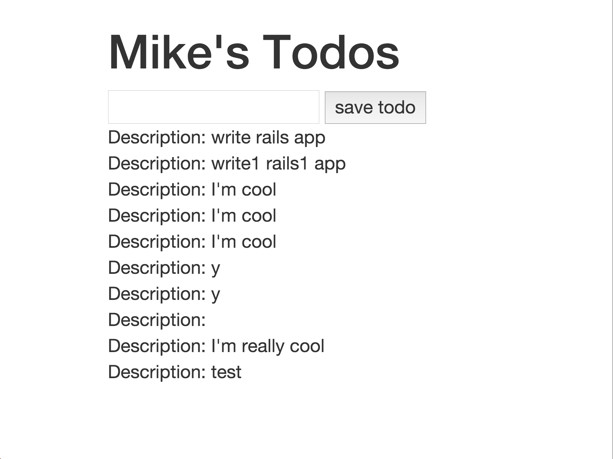

# Adding Styling to your Rails app
To get started you'll need to

1. clone the [extended todos app](git@github.com:sf-wdi-17/extended_todos.git).
2. `cd` into the directory
3. bundle all of the gems 

## Add bootstrap to your page by...
At the top of any page you'd like to have bootstrap on add the following in the `head` of the document. For this lesson we'll be working in the `todos/index.html.erb` file.

```html
<!-- ADD THESE TO THE TOP OF YOUR PAGE -->

<meta name="viewport" content="width=device-width, initial-scale=1">
<!-- Latest compiled and minified CSS -->
<link rel="stylesheet" href="https://maxcdn.bootstrapcdn.com/bootstrap/3.3.4/css/bootstrap.min.css">

<!-- Optional theme -->
<link rel="stylesheet" href="https://maxcdn.bootstrapcdn.com/bootstrap/3.3.4/css/bootstrap-theme.min.css">

<!-- Latest compiled and minified JavaScript -->
<script src="https://maxcdn.bootstrapcdn.com/bootstrap/3.3.4/js/bootstrap.min.js"></script>
```

**Once Bootstrap has been added** Modify the `todos/index.html.erb` so that when we go to the route [http://localhost:3000/authors/1/todos](http://localhost:3000/authors/1/todos) we something like this. **Hint** Use the bootstrap grid.


## Now for adding custom styling

Inspect the `app/assets/stylesheets/` directory in the `task_app` folder. What do you notice? **Hint** Read the contents of each of the files in the folder and follow any leads that they provide.

### Add custom classes and ids to some elements
Try to get a feel for how SCSS works.
